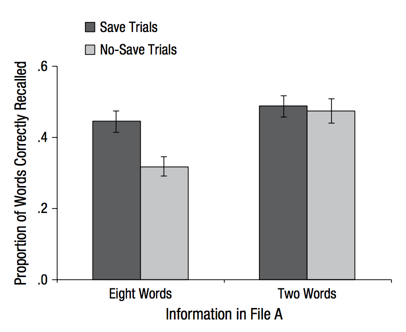

Original Experiment is [here](https://web.stanford.edu/~mkeil/MemoryProject/mkeilProject/experiment/Saving1.html).

##Introduction

This study examines the effect of saving a document on future learning and memory. The study concludes that when a person has the opportunity to save a file before studying another file, they retain more information from this second studying session because interference is lower. The study also finds that  this interference depends on the amount of information that is studied in the first file. In this replication study we expect to see increases in word recall for a second file when participants can save the first file studied or when the file has less information to be learned. 


##Methods

###Power Analysis

In this study the authors conducted a 2x2 mixed-design ANOVA on the recall of File B and found a significant interaction between the word condition and save condition, F(1, 46) = 7.89, MSE = 0.01, p = .007, η2 = .15. Using this information I conducted a post-hoc power analysis for an estimated effect size of n^2 = .15. This results in a power of 82% and a proposed N of 48. 

###Planned Sample
48 person native English speakers from North America. 

###Materials					
> 16 PDF files were created, each containing a single list of 8 common nouns (four to seven letters long). Two files were randomly selected to be used for each of eight trials. One of the files associated with each trial was designated as File A, whereas the other was designated as File B. The files were then named with a trial number and corresponding letter (1A, 1B, 2A, 2B, etc.)

**Modification**: These PDF files will be placed in an online repository, to be accessed during the experiment. 	
					
###Procedure				
> The experiment began with participants watching the experimenter create a folder on the desktop. The folder was named with the date (e.g., 5-4-2014), and participants were told that they would be able to use the folder during the experiment. Participants were then alerted to the flash drive connected to the computer and instructed to open it to view the files inside. The files were said to exist only on the flash drive, not on the computer.

**Modification**: This folder will already exist online. For each trial, two pdf files(A and B) will appear. File A and B will pop-up based on timers. 
					
> Participants were told that the experiment would consist of six trials, each involving the study and testing of the contents of two PDFs. For example, on the first trial, participants studied and were tested on the contents of Files 1A and 1B. They were told that they would always study File A first, but that before being tested on it, they would study and be tested on File B. Half of the trials were save trials, and the other half were no-save trials. Counterbalancing ensured that each file served equally often in the save and no-save conditions. On save trials, participants saved File A before studying and being tested on File B. On no-save trials, participants simply exited File A without saving before studying and being tested on File B. Participants were told that saving File A would ensure that they would be able to restudy it prior to test, which they were indeed allowed to do.
					
> On each trial, participants studied File A unaware of whether they would be instructed to save it. After 15 s of study, participants were told to either save or not save the file into the designated folder. If instructed to save the file, participants navigated to the “Save a copy” option on the file menu and then saved the file into their folder. If instructed to not save the file, participants simply exited the file by clicking the “X” on the top-right corner of the PDF.

**Modification**: A pop-up will appear that will allow participants to save File A and they will see it remain on the website if they are in the save condition. Participants in the no-save condition will also be given a pop-up option asking them to delete the file, and see File A gone from the website after the initial studying period 

> Immediately following, participants were asked to open and study the corresponding File B for 15 s. After File B was closed, there was a short 20-s delay during which participants counted backwards by 3s from a random 3-digit number between 200 and 999.

**Modification**: Instead of counting backwards by 3s, participants write these numbers online, still starting from a random 3-digit number 

> Participants were then given 20 s to recall out loud the words from File B.

**Modification**: Participants will write down recalled words. 

> Finally, participants were given either 20 s to recall the words from File A (no-save trials) or were instructed to open their designated folder and restudy File A for 15 s before being tested on it (save trials). After the conclusion of each trial, participants were given an unrelated distractor task (i.e., the game Tetris for 1 min) before beginning the next trial.
					
> At the outset of the experiment, participants were given both a save trial and a no-save trial so they could experience the reliability of the saving process, then six experimental trials consisting of three save trials and three no-save trials, presented in a semi-random interleaved order. Participants were randomly assigned to either the eight-word condition, in which File A consisted of eight words, or the two-word condition, in which File A consisted of only two words. The two-word lists were created by randomly selecting two of the words from the corresponding eight-word lists. The two conditions were otherwise identical. 


###Analysis Plan
**Data Cleaning**
The data for each participant will go from wide format to tidy format. Each row will be a separate subject trial, and include the participant condition(2 or 8 word), save type condition(save vs. no-save), recall score for file A, and recall score for file B. 

**Data Exclusion**
Any subject’s data in which all trials are not completed will be removed from the data set.  Subject’s will be excluded if they perform two standard deviations below or above mean recall B score. This may be a sign of cheating, such as writing the words down or taking a screenshot while studying. Data will also be excluded if subjects mean digit recall is below two standard deviations of the overall mean. These results would show evidence that the subject is not paying attention to the task and could skew results. Data from trials 1 and 2 will be excluded for each subject, following the original experiment's exclusion protocol. Finally, if a subject does not follow the correct save instructions for any trial their data will be throw out from the final analysis. 

**Recall Performance for File A**
We will run a pairwise t-test between save trials vs. non-save trials in word recall. This analysis will be done separately for two-word and eight-word conditions. 

**Recall Performance for File B**
2 x 2 Mixed Design ANOVA will be run on save vs. no save and two vs. eight word conditions with recall score as the dependent variable. We will run this as an interaction model and expect to see a significant word condition by save condition interaction term. We will also run a pairwise t-test between save trials vs. non-save trials in word recall. This analysis will be done separately for two-word and eight-word conditions. 

###Differences from Original Study
**Sample differences**
The sample is no longer college undergraduates, but instead will consist of native english speakers from North America ages 18 and above. 

**Setting differences**
The setting will be implemented Online using Mechanical Turk instead of in-person. Participants will be using their own computer and accessing materials through an online site, instead of an external zip drive and destop display. This may change how participants react to saving and not saving a file, since this process may be viewed differently online as compared to offline files. 

**Procedure differences**
Participants will write down words recalled instead of verbally responding. This difference could lead to lower recall scores overall, since typing may slow down some participants. Students will complete subtraction problems as a distractor instead of counting backwards from 3 aloud. 

##Results

###Data Preparation

####Load Relevant Libraries and Functions
```{r message=F, warning=F}
library(ggplot2)
library(tidyr)
library(dplyr)
library(lme4)
library(rjson)

sem <- function(x) {sd(x, na.rm=TRUE) / sqrt(length(x))}
ci95 <- function(x) {sem(x) * 1.96}
```

####Import Data Through JSON File to Dataframe
```{r warning=F}
path <- "~/Documents/Psych254/MturkB/"
files <- dir(paste0(path,"production-results/"), 
             pattern = "*.json")
d.raw <- data.frame()
for (f in files) {
  jf <- paste0(path, "production-results/",f)
  jd <- fromJSON(paste(readLines(jf), collapse=""))
  jd$answers$data[9]
  for(i in 1:8){
    id <- data.frame(
                   workerId = jd$WorkerId,
                   trial_num = i,
                   start_num = jd$answers$data[[i]]$start_number,
                   digits = jd$answers$data[[i]]$digits,
                   word_condition = jd$answers$data[[i]]$word_condition,
                   save_choice = jd$answers$data[[i]]$save_choice,
                   save_condition = jd$answers$data[[i]]$save_condition,
                   FileB = jd$answers$data[[i]]$FileB,
                   FileA = jd$answers$data[[i]]$FileA,
                   B_Recall = jd$answers$data[[i]]$B_Recall,
                   A_Recall = jd$answers$data[[i]]$A_Recall,
                   time = jd$answers$data[[i]]$time,
                   age = jd$answers$data[[9]]$age,
                   gender = jd$answers$data[[9]]$gender,
                   homelang = jd$answers$data[[9]]$homelang,
                   race = jd$answers$data[[9]]$race
                   # comments = jd$answers$data[[9]]$comments
                   )
    d.raw <- bind_rows(d.raw, id)
  }
}
```


####Score Digits

This code calculates the number of times the subject correctly subtracted by 3 in the distractor task.
```{r}
d1 <- d.raw
entered_digits = strsplit(d1$digits, "[\n]")

for(i in seq(from=1, to=nrow(d1), by=1)){
  correct_digit = d1$start_num[i]
  digitScore = 0
  for(digit in entered_digits[[i]]){
    correct_digit = correct_digit -3
    if (digit == correct_digit){
      digitScore = digitScore + 1
    }
    correct_digit = as.numeric(digit)
  }
  digitScore
  d1$DigitScore[i] = digitScore
}
```

####Score FileRecall

This piece of code calculates the number of correct words recalled from File A and File B for each trial. The user input is compared to the actual list of words in the file, and for each match the score increases by 1. The code also gives participants credit for accidentally recalling the singular version of a plural word by translating it from singular to plural before scoring (examples: eggs, bikes, planes, and jeans). 
```{r}
#FileA
FileA_split = strsplit(d1$FileA, "[,]")
FileA_recall_split = strsplit(d1$A_Recall, "[\n]")

for(i in seq(from=1, to=nrow(d1), by=1)){
  FileA_split[[i]]
  FileAScore = 0
  for(word in FileA_recall_split[[i]]){
    #adjustment for plural words
    if(word == "egg"){
      word = paste(word,"s",sep = "")
    }
    word = tolower(c(word))
    if ( word %in% FileA_split[[i]]){
      FileAScore = FileAScore + 1
    }
  }
  FileAScore
  d1$AScore[i] = FileAScore
}

#FileB
for(i in seq(from=1, to=nrow(d1), by=1)){
  FileB_split = strsplit(d1$FileB, "[,]")
  FileB_split[[i]]
  FileB_recall_split = strsplit(d1$B_Recall, "[\n]")
  FileBScore = 0
  for(word in FileB_recall_split[[i]]){
    #adjustment for plural words
    if(word == "bike" | word == "plane" | word == "jean"){
      word = paste(word,"s",sep = "")
    }
    word = tolower(c(word))
    if ( word %in% FileB_split[[i]]){
      FileBScore = FileBScore + 1
    }
  }
  FileBScore
  d1$BScore[i] = FileBScore/8
}
```

####Data Exclusion

Remove first two trials(training) from analysis and exemption
```{r}
#remove trialnum 1 and 2
d1 <- d1 %>% filter(trial_num != 1, trial_num != 2)
```


Remove anyone who did not follow save instructions correctly
```{r}
#rename save choice from delete
str(d1)
d1 <- d1 %>% mutate(save_condition = ifelse(save_condition == "nosave","delete","save"))

#remove wrong followers
included_workers <- d1 %>%
group_by(workerId)  %>%
summarise(followed_instructions = all(save_condition == save_choice)) %>%
filter(followed_instructions)
d1 <- d1 %>% filter(workerId %in% included_workers$workerId)
```

Remove those 2 standard deviations below or above in word recall score and digit recall score.
```{r}
d1_means <- d1 %>%group_by(workerId,word_condition) %>% summarise(meanB = mean(BScore), meanA =mean(AScore), meanDigit = mean(DigitScore), meanTime = mean(time))

#filter by recallScore
sb_meanB = sd(d1_means$meanB)
top_cutoff = mean(d1_means$meanB) + (2*sb_meanB)
bottom_cutoff = mean(d1_means$meanB) - (2*sb_meanB)

d1_keep <- filter(d1_means, meanB < top_cutoff & meanB > bottom_cutoff)

#filter by digitScore
sb_digitScore = sd(d1_means$meanDigit)
digit_top_cutoff = mean(d1_means$meanDigit) + (2*sb_digitScore)
digit_bottom_cutoff = mean(d1_means$meanDigit) - (2*sb_digitScore)

d1_keep <- filter(d1_means, meanDigit < digit_top_cutoff & meanDigit > digit_bottom_cutoff)
```

####Plots of Data
Histogram of File B Recall Scores
```{r}
qplot(meanB, data = d1_means, geom ="histogram",binwidth = .1)
```

Histogram of File A Recall Scores
```{r}
qplot(meanA, data = d1_means, geom ="histogram", binwidth = .1)
```

Histogram of Time
```{r}
qplot(meanTime, data = d1_means, geom ="histogram")
```

Histogram of Digit Recall
```{r}
qplot(meanDigit, data = d1_means, geom ="histogram", binwidth = .5)
```

<div style="width:600px; height=400px"; float = left">
Plot By Save vs. No-Save condition
```{r}
d1_bar <- d1 %>%group_by(workerId,word_condition,save_condition) %>% summarise(meanB = mean(BScore), meanA =mean(AScore), meanDigit = mean(DigitScore), meanTime = mean(time), seB = sem(BScore))

d2_bar <- d1_bar %>%group_by(word_condition,save_condition) %>% summarise(meanBacross = mean(meanB), meanA =mean(meanA), meanDigit = mean(meanDigit), meanTime = mean(meanTime), seB = sem(meanB))

d2_bar$word_condition = as.factor(d2_bar$word_condition)

#The plot of Study 3 in the paper
ggplot(d2_bar,aes(x = word_condition, y = meanBacross,fill=save_condition))+
  geom_bar(position='dodge',stat='identity')+
  geom_errorbar(aes(ymin=meanBacross-seB,ymax=meanBacross+seB),
                width=.2,
                position=position_dodge(.9)) + theme_bw() + ylab("Proportion of Words Correctly Recalled") + xlab("Information in File A")
```
</div>
<div style="width:600px; height=400px; float = left">

</div>


###Confirmatory Analysis

####Recall Performance for File A
```{r}
#t-test 8-word condition
ttestA8 = t.test(meanA ~ save_condition, data = d1_bar %>% filter(word_condition == 8))
ttestA8

#t-test 2-word condition
ttestA2 = t.test(meanA ~ save_condition, data = d1_bar %>% filter(word_condition == 2))
ttestA2
```

####Recall Performance for File B
```{r}
#t-test 8-word condition: Key Result
ttestB8 = t.test(meanB ~ save_condition, data = d1_bar %>% filter(word_condition == 8))
ttestB8

#t-test 2-word condition
ttestB2 = t.test(meanB ~ save_condition, data = d1_bar %>% filter(word_condition == 2))
ttestB2
```

####Mixed Design ANOVA for File B Performance
```{r}
d1$word_condition = as.factor(d1$word_condition)
aov_mixed <- aov(BScore ~ save_condition*word_condition + Error(workerId/save_condition), data=d1)
summary(aov_mixed)
```

###Exploratory Analyses

####The Influence of Demographic Factors on Performance
```{r}
```

####The Effect of Trial Number on Performance
Plot by Trial Number
```{r}
ggplot(d1,aes(trial_num,BScore))+
  geom_jitter(aes(colour = save_condition))
```

####The Effect of File Number on Performance
Plot By File Number
```{r}
ggplot(d1,aes(FileB,BScore))+
  geom_jitter(aes(colour = save_condition))
```

```{r}

```

####The Effect of Digit Recall on Performance
Plot By Digit Recall Score
```{r}
ggplot(d1,aes(DigitScore,BScore))+
  geom_jitter(aes(colour = save_condition))
```


####The Effect of File A Recall Score on File B Recall Scores for 8-word No-Save condition
```{r}
# d1
#  ggplot(d1,aes(AScore[word_condition==8],BScore[word_condition==8]))+
#    geom_point(aes(colour = save_condition[word_condition==8]))
```

##Discussion

###Summary of Replication Attempt

###Commentary